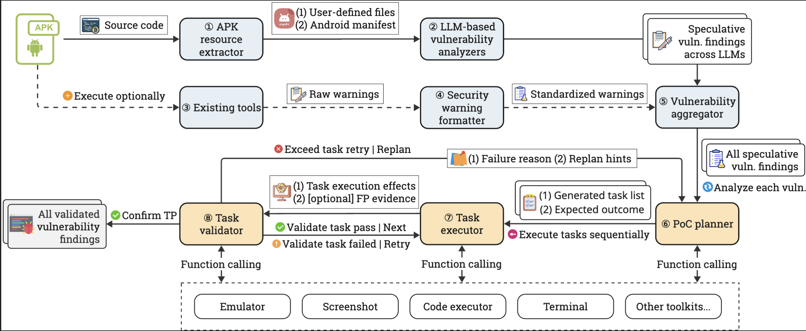

<div style="text-align: center; margin-bottom: 2em;">
  <h1 style="margin-bottom: 0.5em;">Agentic Discovery and Validation of Android App Vulnerabilities</h1>

  <p style="font-size: 1.1em; margin-bottom: 1em;">
    <a href="https://zyy0530.github.io/" target="_blank">Ziyue Wang</a><sup>1</sup>,
    <a href="https://lzhou1110.github.io/" target="_blank">Liyi Zhou</a><sup>2,3,4</sup>
  </p>

  <p style="font-size: 0.9em; color: #666; margin-bottom: 1em;">
    <sup>1</sup>Nanjing University<br>
    <sup>2</sup>The University of Sydney,
    <sup>3</sup>Decentralized Intelligence AG,
    <sup>4</sup>UC Berkeley RDI
  </p>

  <p style="margin-top: 1em;">
    <a href="https://arxiv.org/abs/2508.21579" target="_blank" style="padding: 10px 20px; background-color: #0366d6; color: white; text-decoration: none; border-radius: 5px; margin: 5px;">📄 Paper</a>
  </p>
</div>

---

## Real-World Vulnerability Discoveries

- **2025-10-19**: A2 discovered a vulnerability in an application from ██████ (a US tier-1 company). Our vulnerability report is currently under review.

- **2025-10-18**: A2 discovered a vulnerability in an application from ██████ (a Chinese tier-1 company). Our vulnerability report is currently under review.

- 🎉**2025-09-20**: A2 discovered a privacy vulnerability in Via Browser ([Google Play](https://play.google.com/store/apps/details?id=mark.via.gp), 10M+ downloads). The vulnerability has been fixed in version 6.7.0.

- **2025-09**: We are currently conducting responsible disclosure for vulnerabilities discovered in 50+ production applications.


## Abstract

Existing Android vulnerability detection tools overwhelm teams with thousands of low-signal warnings yet uncover few true positives. Analysts spend days triaging these results, creating a bottleneck in the security pipeline. Meanwhile, genuinely exploitable vulnerabilities often slip through, leaving opportunities open to malicious counterparts.

We introduce **A2**, a system that mirrors how security experts analyze and validate Android vulnerabilities through two complementary phases: *(i)* **Agentic Vulnerability Discovery**, which reasons about application security by combining semantic understanding with traditional security tools; and *(ii)* **Agentic Vulnerability Validation**, which systematically validates vulnerabilities across Android's multi-modal attack surface—UI interactions, inter-component communication, file system operations, and cryptographic computations.

On the Ghera benchmark (*n*=60), A2 achieves **78.3% coverage**, surpassing state-of-the-art analyzers (e.g., APKHunt 30.0%). Rather than overwhelming analysts with thousands of warnings, A2 distills results into 82 speculative vulnerability findings, including 47 Ghera cases and 28 additional true positives. Crucially, A2 then generates working Proof-of-Concepts (PoCs) for 51 of these speculative findings, transforming them into validated vulnerability findings that provide direct, self-confirming evidence of exploitability.

In real-world evaluation on 169 production APKs, A2 uncovers **104 true-positive zero-day vulnerabilities**. Among these, 57 (54.8%) are self-validated with automatically generated PoCs, including a medium-severity vulnerability in a widely used application with over 10 million installs.

---

## A2 Workflow

<div style="text-align: center; margin: 2em 0;">
  

  <p style="font-size: 0.9em; color: #666; margin-top: 1em; text-align: left;">
    <strong>Figure:</strong> The end-to-end workflow of A2, from APK input to validated vulnerability findings with proof-of-concept output. A2 operates in two phases: <strong>Agentic Vulnerability Discovery</strong> (①-⑤, blue blocks) and <strong>Agentic Vulnerability Validation</strong> (⑥–⑧, brown blocks). In the vulnerability discovery phase, the target APK is decompiled and its resources extracted (①). LLM agents then analyze the application (②), producing speculative vulnerability findings. Optionally, warnings from existing SAST tools (③) are passed through the formatter (④), which standardizes them and produces additional speculative vulnerability findings to enhance coverage and confidence. All speculative findings are then consolidated by the aggregator (⑤). In the vulnerability validation phase, each speculative vulnerability finding is passed to the PoC planner (⑥), which generates task lists with expected outcomes. The task executor (⑦) sequentially carries out these tasks through function calls (e.g., emulator, screenshot analysis, code execution, terminal commands, and etc.) Finally, the task validator (⑧) independently verifies outcomes using multiple oracles, providing feedback for iterative refinement until either successful validation or retry limits are reached.
  </p>
</div>

---

## Key Contributions

- **Human-Level End-to-end Security Analysis**: A2 is the first system to mimic expert practices in vulnerability assessment, performing agentic vulnerability discovery and validation.

- **New SOTA on Ghera Benchmark**: Achieves 78.3% coverage (47/60) on the Ghera benchmark, surpassing existing state-of-the-art analyzers.

- **LLM-based Vulnerability Validation**: Automatically generates working PoC exploits with a 61.3-68.0% success rate on actionable vulnerabilities.

- **Zero-Day Discoveries**: Discovered 104 true-positive zero-day vulnerabilities in 169 production APKs, with 54.8% self-validated through automated PoC generation.

---

## Citation

```bibtex
@article{wang2025a2,
  title={Agentic Discovery and Validation of Android App Vulnerabilities},
  author={Wang, Ziyue and Zhou, Liyi},
  journal={arXiv preprint arXiv:2508.21579},
  year={2025}
}
```


## Open Source

We are in the vulnerability disclose stage. After that, the A2 code will be open source.

---

## Acknowledgments

We gratefully acknowledge [AndroZoo](https://androzoo.uni.lu/) for providing access to their comprehensive collection of real-world Android applications.

